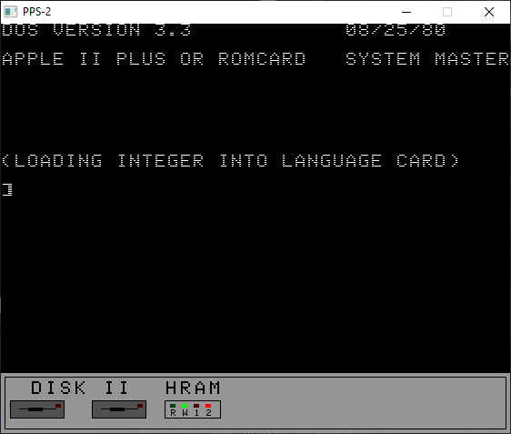

# PPS-2

---
## P P System 2 - An Apple II emulator born for fun
 

## What is PPS2 ?

---

>  PPS2 is a complete 6502 personal computer emulation system.
The idea, born as a joke, was to validate the correct functioning of a software emulator for the 6502 microprocessor.
The first project (PPS1) developed over a few hours was limited to the emulation of a system with serial I / O. 
The system thus created resembled an old APPLE 1 with several limitations. 
Hence the idea of ​​turning it into real personal computer emulation system compatible with the Apple II series.
At present, PPS2 is able to emulate the operation of the entire family of Apple II personal computers (Apple 2, Apple 2 plus, Apple 2e).
The emulation has good accuracy with regards to the execution speed, low and high resolution graphics, paddle and keyboard emulation and the I / O operations of the disk II controller.

---